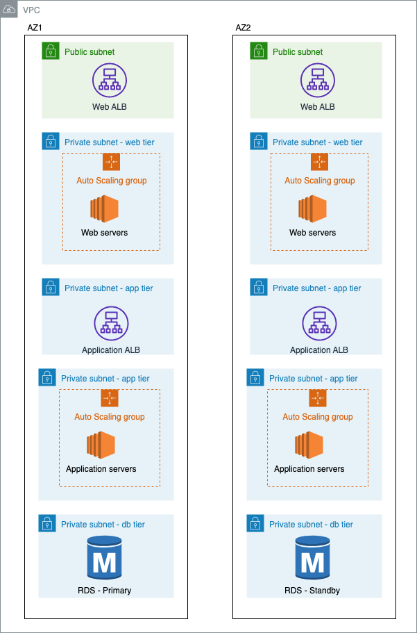
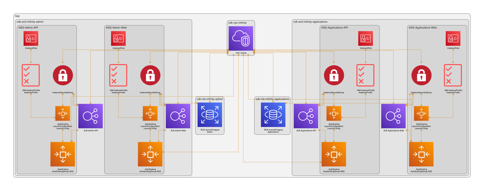

# Create VPC, EC2 ASG, and RDS instance with AWS CDK Python

This is a project to create a new VPC, EC2 Auto Scaling group, Load Balancers and RDS instance on AWS with the AWS Cloud Development Kit.

This project:
* Create VPC in 5 tier layers of subnets: PUBLIC, PRIVATE and ISOLATED, you can specify the number of AZs and the CIDR.
* Create instance and NAT Gateway
* Create ALB, EC2 Autoscaling group with scaling policy, and custom EBS volume
* Create RDS instance (MySQL multi-AZ or Aurora)
* Create security group and allow access from the other security group: 
* Using customized EC2 user data and specifying generated AMI properties with no need to specify the AMI id in every region

## Architecture


You can use [cdk-dia](https://github.com/pistazie/cdk-dia) to automatically produce an architecture diagram directly from CDK:



## AWS Cloud Development Kit (AWS CDK)
The **AWS Cloud Development Kit (AWS CDK)** is an open-source software development
framework to define cloud infrastructure in code and provision it through AWS CloudFormation.

It offers a high-level object-oriented abstraction to define AWS resources imperatively using
the power of modern programming languages. Using the CDK’s library of
infrastructure constructs, you can easily encapsulate AWS best practices in your
infrastructure definition and share it without worrying about boilerplate logic.

## Getting Started

For a detailed walkthrough, see the [tutorial](https://docs.aws.amazon.com/cdk/latest/guide/getting_started.html#hello_world_tutorial) in the AWS CDK [Developer Guide](https://docs.aws.amazon.com/cdk/latest/guide/home.html).

### At a glance

Install or update the [AWS CDK CLI] from npm (requires [Node.js ≥ 14.15.0](https://nodejs.org/download/release/latest-v14.x/)). We recommend using a version in [Active LTS](https://nodejs.org/en/about/releases/)

```sh
npm i -g aws-cdk
```

## Useful commands

 * `cdk ls`          list all stacks in the app
 * `cdk synth`       emits the synthesized CloudFormation template
 * `cdk deploy`      deploy this stack to your default AWS account/region
 * `cdk diff`        compare deployed stack with current state
 * `cdk docs`        open CDK documentation


## Examples <a name="Examples"></a>
https://github.com/aws-samples/aws-cdk-examples  contains a set of example projects for the [AWS Cloud Development Kit](https://github.com/awslabs/aws-cdk).

Its the official list of CDK example code. The repo is subdivided into sections for each language (see ["Examples"](#Examples)). Each language has its own subsection of examples with the ultimate aim of complete language parity (same subset of examples exist in each language). These examples each provide a demonstration of a common service implementation, or infrastructure pattern that could be useful in your use of the CDK for building your own infrastructure.
This repo contains examples in each language supported by the CDK. Some languages are fully supported by [JSII](https://github.com/aws/jsii), but as additional languages are added, you will see those marked as `Developer Preview`. You can find the examples for each of those languages at the following links:

| Language | JSII Language-Stability |
|----------|-------------------------|
| [Typescript Examples](https://github.com/aws-samples/aws-cdk-examples/tree/master/typescript) | _Stable_ |
| [Python Examples](https://github.com/aws-samples/aws-cdk-examples/tree/master/python) | _Stable_ |
| [.NET Examples](https://github.com/aws-samples/aws-cdk-examples/tree/master/csharp) | _Stable_ |
| [Java Examples](https://github.com/aws-samples/aws-cdk-examples/tree/master/java) | _Stable_ |
| [Go Examples](https://github.com/aws-samples/aws-cdk-examples/tree/master/go) | _Stable_ |


## Learning Resources <a name="Learning"></a>
While this is an excellent learning resource for the CDK, there are other resources that can be referenced to assist with your learning/development process.

### Official Resources
- [Developer Guide](https://docs.aws.amazon.com/cdk/latest/guide/home.html)
- [API Reference](https://docs.aws.amazon.com/cdk/api/latest/docs/aws-construct-library.html)
- [CDK Workshop](https://cdkworkshop.com/)
- [CDK Repository](https://github.com/aws/aws-cdk)